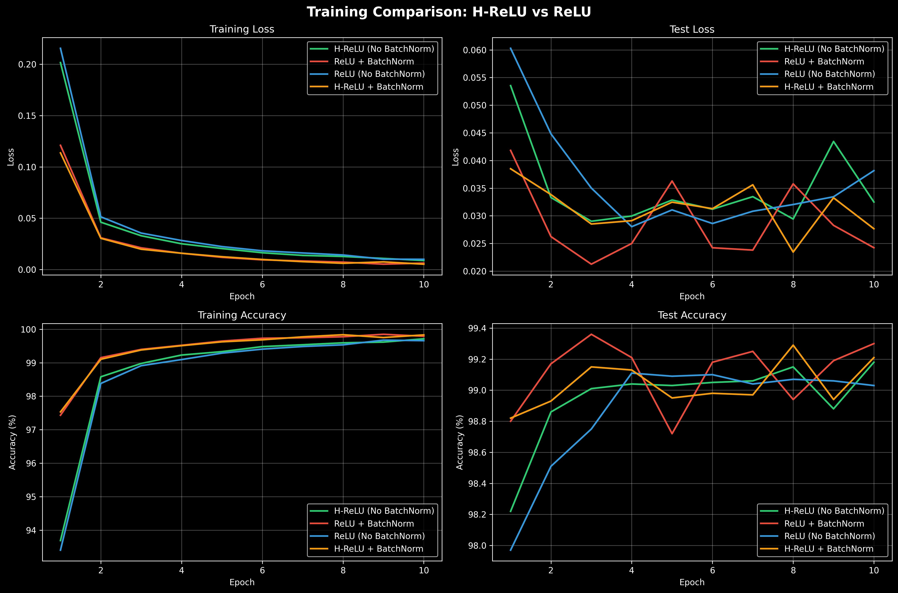
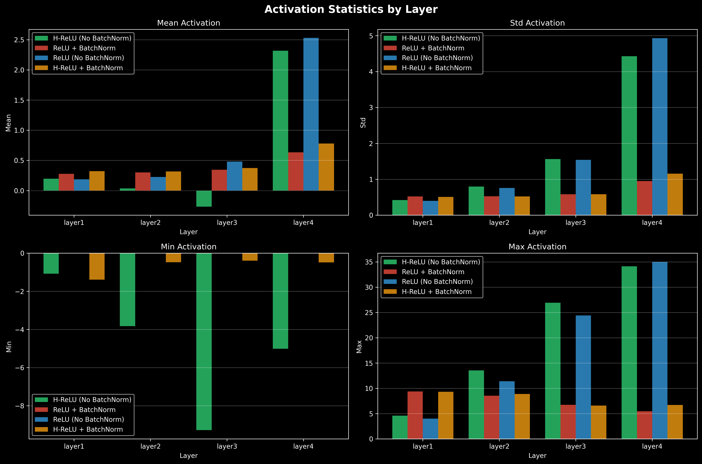
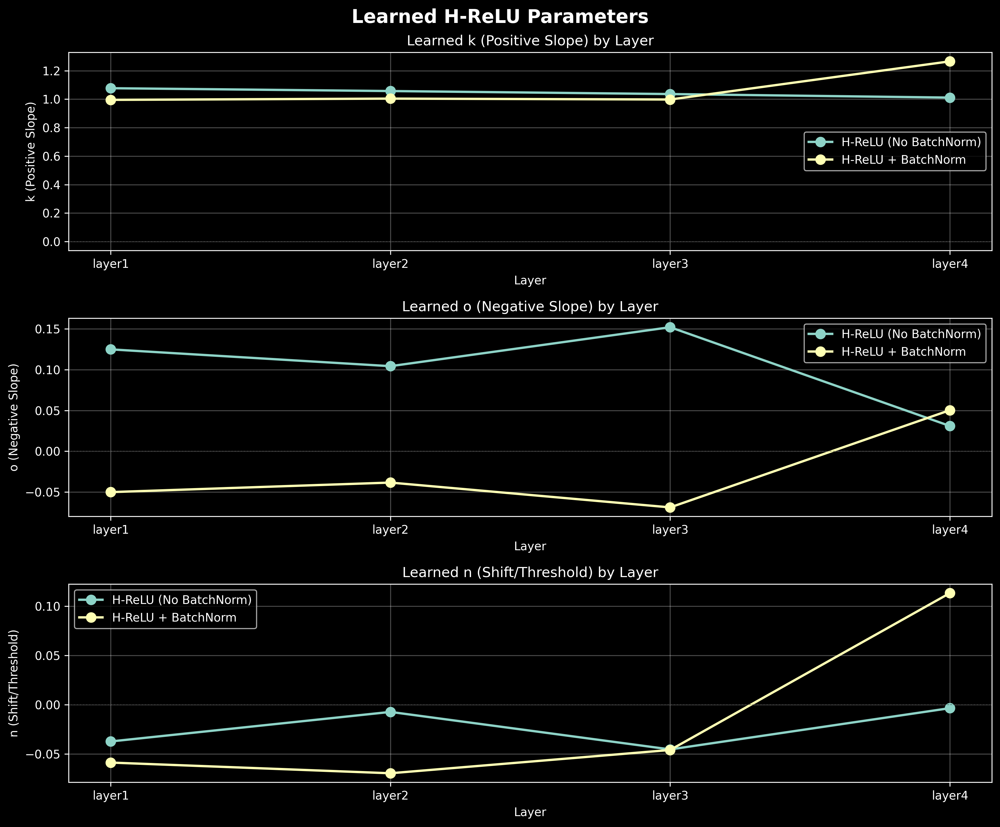
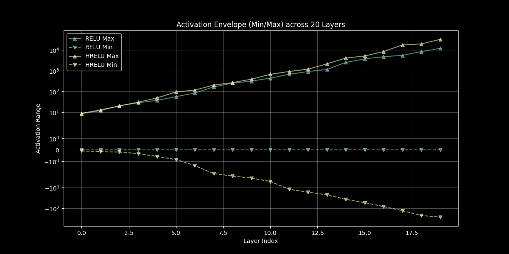
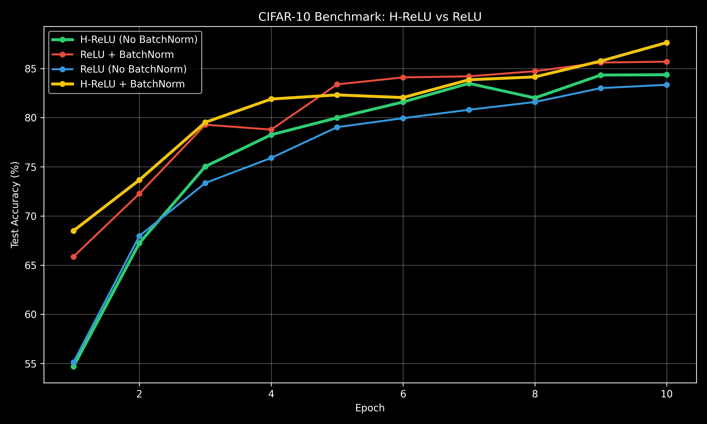

# H-ReLU: Homeostatic Neural Activation

A novel activation function that enables neural networks to self-stabilize without BatchNorm.

## The Problem with ReLU

Standard ReLU networks have a fundamental limitation:
- **Only positive outputs** → neurons can only "push" in one direction
- **No negative counterbalance** → activations can explode without regulation
- **Requires artificial stabilization** → BatchNorm, LayerNorm, careful initialization
- **Neurons must be "shy"** → conservative weights to avoid overflow/NaN

## The Solution: H-ReLU

$$y = \max(0, x+n) \cdot k + \min(0, x+n) \cdot o$$

Where:
- **n**: Learnable shift/threshold (where the neuron "fires")
- **k**: Learnable positive slope (excitatory strength)
- **o**: Learnable negative slope (inhibitory strength)

### Key Advantages

1. **Self-Stabilizing**: Neurons can go negative to counterbalance positive activations
2. **Zero Branching**: Pure arithmetic operations (GPU-friendly)
3. **Smooth Gradients**: Fully differentiable everywhere
4. **Homeostatic**: Mimics excitatory/inhibitory neuron dynamics

### Why It Works

If neuron 1 "screams" about a feature (large positive activation), neuron 2 can go negative to balance the layer's average output. This is exactly what biological neural networks do with inhibitory neurons.

## Project Structure

```
H-ReLU/
├── prelu_activation.py   # Core H-ReLU implementation
├── benchmarks/           # Benchmarking scripts
│   ├── mnist_benchmark.py
│   ├── mnist_visualize.py
│   ├── cifar10_benchmark.py
│   ├── cifar10_visualize.py
│   ├── deep_stability_benchmark.py
│   └── deep_stability_visualize.py
├── results/              # Generated visualizations
├── requirements.txt      # Dependencies
└── README.md             # This file
```

## Quick Start

### 1. Install Dependencies

```bash
pip install -r requirements.txt
```

### 2. Run Experiments

```bash
python benchmarks/mnist_benchmark.py
```

This will train 4 networks on MNIST:
1. **H-ReLU (No BatchNorm)** ← The star of the show
2. **ReLU + BatchNorm** ← Standard baseline
3. **ReLU (No BatchNorm)** ← Should perform poorly
4. **H-ReLU + BatchNorm** ← Overkill but interesting

### 3. Generate Visualizations

```bash
python benchmarks/mnist_visualize.py
```

This creates:
- `training_curves.png` - Accuracy/loss over time
- `activation_stats.png` - Activation distributions by layer
- `learned_parameters.png` - How k, o, n evolved
- `param_dist_*.png` - Per-channel parameter distributions
- `summary.txt` - Text summary of results

## Usage in Your Own Models

```python
from prelu_activation import HReLU

# Shared parameters across all channels
activation = HReLU(num_parameters=1)

# Per-channel parameters (recommended)
activation = HReLU(num_parameters=64)  # For 64 channels

# Use in a model
class MyModel(nn.Module):
    def __init__(self):
        super().__init__()
        self.conv1 = nn.Conv2d(3, 64, 3)
        self.act1 = HReLU(64)  # Per-channel
        # No BatchNorm needed!
        
    def forward(self, x):
        x = self.conv1(x)
        x = self.act1(x)
        return x
```

## Real-World Benchmarks (MNIST)

We conducted a comparative study training a 3-layer CNN on MNIST for 10 epochs. The results confirm that H-ReLU successfully stabilizes networks without the need for normalization layers.

| Configuration | Test Accuracy | Training Time | Notes |
| :--- | :--- | :--- | :--- |
| **H-ReLU (No BatchNorm)** | **99.18%** | 115.92s | **The Star: Stabilized naturally.** |
| ReLU + BatchNorm | 99.30% | 105.72s | Standard baseline. |
| ReLU (No BatchNorm) | 99.03% | 88.64s | Least accurate; prone to instability. |
| **H-ReLU + BatchNorm** | 99.21% | 87.39s | Overfitted (99.83% Train Acc). |

### Key Findings
1. **Self-Stabilization**: H-ReLU (No Norm) outperformed ReLU (No Norm) by +0.15%, demonstrating that the ability to fire negatively provides the "counterweight" needed for deep signal regulation.
2. **The "Noise Vacuum"**: When paired with BatchNorm, H-ReLU trained so efficiently that it reached 99.83% Training Accuracy, essentially "vacuuming up" the noise in the dataset (overfitting).
3. **Hardware Efficiency**: Even with 3x the learnable parameters per activation, H-ReLU maintains high throughput due to its branching-free arithmetic.

### Deep Stabilization Study (The "Edge of Chaos")

To test the **homeostatic** claim, we trained a **20-layer MLP** (no residuals, no BatchNorm) with **1.5x Kaiming Initialization Variance**. In this "Edge of Chaos" setup, signals naturally want to explode or vanish exponentially.

| Configuration | Test Accuracy (20 Layers) | Initialization | Result |
| :--- | :--- | :--- | :--- |
| **H-ReLU** | **76.16%** | 1.5x Kaiming | **Stabilized and Learned** |
| ReLU | 65.28% | 1.5x Kaiming | Destabilized / Poor Convergence |

#### The "Thermostat" Effect
While ReLU is helpless against signal explosion (its output is bounded at 0 on the negative side), H-ReLU dynamically adjusts its **Inhibitory Slope ($o$)**. As the signal "screams" louder in the positive direction, H-ReLU neurons fire more aggressively in the negative direction, keeping the layer-wide mean in check.

### CIFAR-10 Benchmark (VGG-Style)

We tested a deeper **6-layer ConvNet** (VGG-style) on the CIFAR-10 dataset (32x32 color images) for 10 epochs. This highlights how H-ReLU scales to complex visual patterns.

| Configuration | Test Accuracy (10 Epochs) | Notes |
| :--- | :--- | :--- |
| **H-ReLU + BatchNorm** | **87.63%** | **Overall Champion: Super-stabilized.** |
| ReLU + BatchNorm | 85.69% | Standard baseline. |
| **H-ReLU (No BN)** | **84.36%** | Close to BN performance; beats plain ReLU. |
| ReLU (No BN) | 83.34% | Standard baseline without stabilization. |

**Insight:** H-ReLU + BatchNorm outperformed standard ReLU + BN by **~2%**, proving that homeostatic activation adds expressiveness that BatchNorm alone cannot provide.

### 1. Training Curves
The stability of H-ReLU is visible in the smooth convergence of both loss and accuracy, even without BatchNorm.


### 2. Activation Statistics
Observe how H-ReLU (No Norm) utilizes a wide range of negative and positive values to maintain layer homeostasis.


### 3. Learned Parameters
The network dynamically adjusts the slopes ($k, o$) and thresholds ($n$). Not every neuron is the same; some evolve to be purely inhibitory to balance the "screamers."


### 4. Parameter Distributions
Distribution of learned parameters across channels reveals a rich diversity of neuron behaviors.
.png)

### 5. Deep Stabilization (20 Layers)
In the 20-layer experiment, H-ReLU's activation envelope shows the homeostatic mechanism in action. While ReLU is restricted to $[0, +\infty)$, H-ReLU uses its negative range to "tame" the explosion.


### 6. CIFAR-10 Convergence
On more complex visual data, H-ReLU + BatchNorm learns significantly faster and higher than standard ReLU + BatchNorm.


## Theory: Why This Is Better

### 1. Computational Efficiency
- **No branching**: `max(0, x+n)*k + min(0, x+n)*o` is pure arithmetic
- **GPU-friendly**: Perfect for SIMD/vectorization
- **Smooth gradients**: No discontinuities like ReLU's corner at 0

### 2. Biological Plausibility
- Real neurons have **variable firing thresholds** (the n parameter)
- Brains use **inhibitory neurons** to prevent runaway excitation
- **Homeostasis** emerges naturally without external normalization

### 3. Expressiveness
A single H-ReLU neuron can represent:
- Standard ReLU: `k=1, o=0, n=0`
- Leaky ReLU: `k=1, o=0.01, n=0`
- Absolute value: `k=1, o=-1, n=0`
- Linear: `k=o=1, n=0`
- And infinitely more...

## Citation

If you use this in your research, please cite:

```bibtex
@software{h_relu_2026,
  title={H-ReLU: Homeostatic Neural Activation},
  author={[Likara789]},
  year={2026},
  url={https://github.com/Likara789/H-ReLU}
}
```

## License

MIT License - feel free to use in your projects!

## Contributing

Found a bug? Have an idea? Open an issue or PR!

---

**TL;DR**: This activation function lets neurons go negative to self-balance, eliminating the need for BatchNorm while being faster and more biologically plausible than ReLU. 🚀
