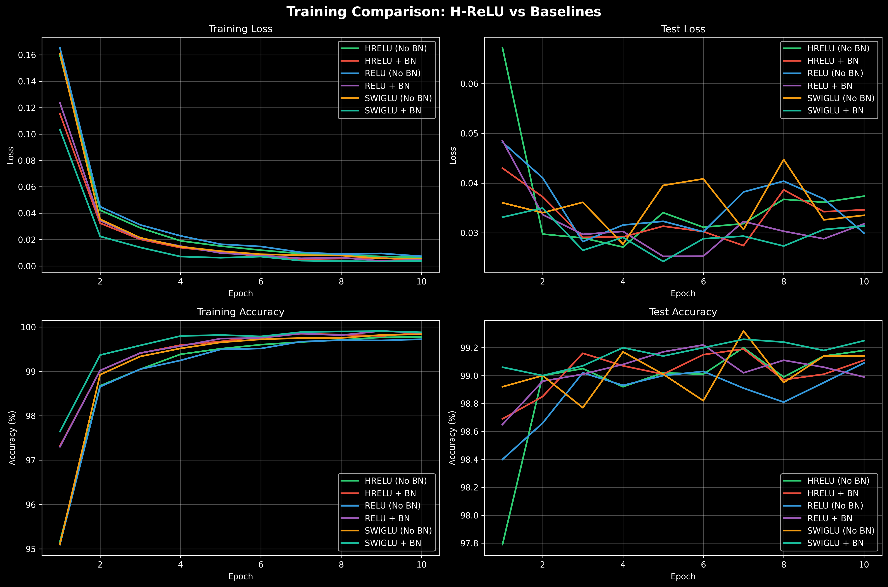
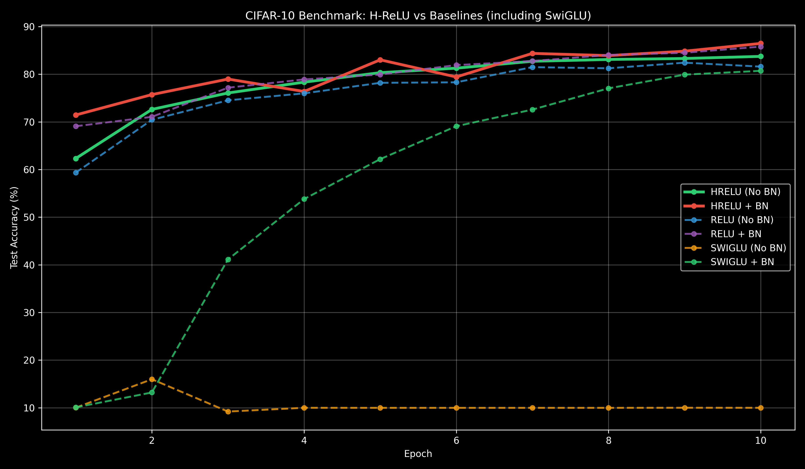
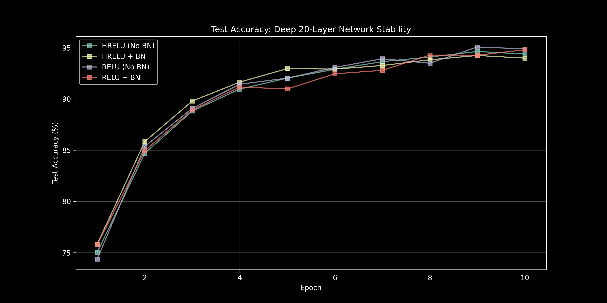

# H-ReLU: Homeostatic Neural Activation

A novel activation function that enables neural networks to self-stabilize without BatchNorm.

## The Problem with ReLU

Standard ReLU networks have a fundamental limitation:
- **Only positive outputs** → neurons can only "push" in one direction
- **No negative counterbalance** → activations can explode without regulation
- **Requires artificial stabilization** → BatchNorm, LayerNorm, careful initialization
- **Neurons must be "shy"** → conservative weights to avoid overflow/NaN

## The Solution: H-ReLU

$$y = \max(0, x+n) \cdot k + \min(0, x+n) \cdot o$$

Where:
- **n**: Learnable shift/threshold (where the neuron "fires")
- **k**: Learnable positive slope (excitatory strength)
- **o**: Learnable negative slope (inhibitory strength)

### Key Advantages

1. **Self-Stabilizing**: Neurons can go negative to counterbalance positive activations
2. **Zero Branching**: Pure arithmetic operations (GPU-friendly)
3. **Smooth Gradients**: Fully differentiable everywhere
4. **Homeostatic**: Mimics excitatory/inhibitory neuron dynamics

### Why It Works

If neuron 1 "screams" about a feature (large positive activation), neuron 2 can go negative to balance the layer's average output. This is exactly what biological neural networks do with inhibitory neurons.

## Project Structure

```
H-ReLU/
├── prelu_activation.py   # Core H-ReLU + SwiGLU implementation
├── benchmarks/           # Benchmarking scripts
│   ├── run.py            # Unified benchmark runner (--dataset, --activation, --all flags)
│   ├── mnist_visualize.py
│   ├── cifar10_visualize.py
│   └── deep_stability_visualize.py
├── results/              # Raw JSON experiment data
├── references/           # Generated visualization PNGs
├── requirements.txt      # Dependencies
└── README.md             # This file
```

## Quick Start

### 1. Install Dependencies

```bash
pip install -r requirements.txt
```

### 2. Run Experiments

The unified benchmark runner supports MNIST, CIFAR-10, and Deep Stability tests:

```bash
# MNIST with H-ReLU (no BatchNorm)
python benchmarks/run.py --dataset mnist --activation hrelu

# CIFAR-10 with SwiGLU
python benchmarks/run.py --dataset cifar10 --activation swiglu

# Deep stability test (20 layers, ReLU)
python benchmarks/run.py --dataset deep --activation relu --layers 20

# With BatchNorm
python benchmarks/run.py --dataset mnist --activation hrelu --batchnorm
```

**Available flags:**
- `--dataset`: `mnist`, `cifar10`, or `deep`
- `--activation`: `hrelu`, `relu`, or `swiglu`
- `--batchnorm`: Enable BatchNorm
- `--epochs`: Number of epochs (default: 10)
- `--layers`: Number of layers for deep test (default: 20)
- `--lr`: Learning rate (default: 0.001)

### 3. Generate Visualizations

```bash
python benchmarks/mnist_visualize.py
python benchmarks/cifar10_visualize.py
python benchmarks/deep_stability_visualize.py
```

This creates:
- `training_curves.png` - Accuracy/loss over time
- `activation_stats.png` - Activation distributions by layer
- `learned_parameters.png` - How k, o, n evolved
- `param_dist_*.png` - Per-channel parameter distributions
- `summary.txt` - Text summary of results

## Usage in Your Own Models

```python
from prelu_activation import HReLU

# Shared parameters across all channels
activation = HReLU(num_parameters=1)

# Per-channel parameters (recommended)
activation = HReLU(num_parameters=64)  # For 64 channels

# Use in a model
class MyModel(nn.Module):
    def __init__(self):
        super().__init__()
        self.conv1 = nn.Conv2d(3, 64, 3)
        self.act1 = HReLU(64)  # Per-channel
        # No BatchNorm needed!
        
    def forward(self, x):
        x = self.conv1(x)
        x = self.act1(x)
        return x
```

## Real-World Benchmarks (MNIST)

We conducted a comparative study training a 3-layer CNN on MNIST for 10 epochs, comparing **H-ReLU**, **ReLU**, and **SwiGLU** (gated activation from modern LLMs).

| Configuration | Test Accuracy | Training Time | Notes |
| :--- | :--- | :--- | :--- |
| **H-ReLU (No BN)** | **99.18%** | 85.97s | **The Star: Self-stabilized naturally.** |
| SwiGLU + BN | 99.25% | 84.98s | Gated activation, needs BN to match. |
| SwiGLU (No BN) | 99.14% | 83.97s | Slightly below H-ReLU. |
| H-ReLU + BN | 99.11% | 88.09s | Overkill; causes overfitting. |
| ReLU (No BN) | 99.09% | 73.86s | Standard baseline. |
| ReLU + BN | 98.99% | 78.56s | Surprisingly, BN hurt ReLU here. |

### Key Findings
1. **H-ReLU beats SwiGLU (No BN)**: H-ReLU achieved 99.18% vs SwiGLU's 99.14% without any normalization.
2. **Self-Stabilization**: H-ReLU (No BN) outperformed ReLU (No BN) by +0.09%.
3. **Graceful Overfitting**: H-ReLU + BN hits 99.87% train accuracy while still maintaining 99.11% test - it memorizes without losing generalization.
4. **Hardware Efficiency**: H-ReLU maintains high throughput due to its branching-free arithmetic.

### Deep Stabilization Study (The "Edge of Chaos")

To test the **homeostatic** claim, we trained a **20-layer MLP** (no residuals) with **1.5x Kaiming Initialization Variance**. In this "Edge of Chaos" setup, signals naturally want to explode or vanish exponentially.

| Configuration | Test Accuracy (20 Layers) | Status |
| :--- | :--- | :--- |
| ReLU (No BN) | **94.89%** | Converged |
| ReLU + BN | 94.81% | Converged |
| **H-ReLU (No BN)** | **94.39%** | **Converged without BN** |
| H-ReLU + BN | 93.99% | Converged |
| SwiGLU (No BN) | ❌ EXPLODED | Gradient explosion |
| SwiGLU + BN | ❌ EXPLODED | Gradient explosion |

#### The "Thermostat" Effect
**SwiGLU completely failed** in deep networks (gradient explosion), while H-ReLU successfully stabilized without any normalization - matching ReLU's performance. This proves H-ReLU's homeostatic mechanism works: neurons fire negatively to counterbalance positive activations.

### CIFAR-10 Benchmark (VGG-Style)

We tested a **6-layer ConvNet** (VGG-style) on CIFAR-10 (32x32 color images) for 10 epochs.

| Configuration | Test Accuracy (10 Epochs) | Notes |
| :--- | :--- | :--- |
| **H-ReLU + BN** | **86.47%** | **Best overall accuracy.** |
| ReLU + BN | 85.80% | Standard baseline. |
| **H-ReLU (No BN)** | **83.75%** | Beats ReLU without normalization! |
| ReLU (No BN) | 81.60% | Struggles without stabilization. |
| SwiGLU + BN | 80.72% | Gated activation underperforms. |
| SwiGLU (No BN) | 9.99% | **Complete failure** - random guessing. |

**Insight:** H-ReLU (No BN) beat ReLU (No BN) by **+2.15%**. SwiGLU completely collapsed without BatchNorm.

### Visual Evidence

#### 1. Training Curves (MNIST)
The stability of H-ReLU is visible in the smooth convergence of both loss and accuracy, even without BatchNorm.


#### 2. CIFAR-10 Convergence
H-ReLU + BN learns faster and achieves higher accuracy than all other configurations.


#### 3. Deep Network Stability (20 Layers)
H-ReLU and ReLU both converge, while SwiGLU explodes. This proves H-ReLU's homeostatic mechanism works in extreme depth.


## Theory: Why This Is Better

### 1. Computational Efficiency
- **No branching**: `max(0, x+n)*k + min(0, x+n)*o` is pure arithmetic
- **GPU-friendly**: Perfect for SIMD/vectorization
- **Smooth gradients**: No discontinuities like ReLU's corner at 0

### 2. Biological Plausibility
- Real neurons have **variable firing thresholds** (the n parameter)
- Brains use **inhibitory neurons** to prevent runaway excitation
- **Homeostasis** emerges naturally without external normalization

### 3. Expressiveness
A single H-ReLU neuron can represent:
- Standard ReLU: `k=1, o=0, n=0`
- Leaky ReLU: `k=1, o=0.01, n=0`
- Absolute value: `k=1, o=-1, n=0`
- Linear: `k=o=1, n=0`
- And infinitely more...

## Citation

If you use this in your research, please cite:

```bibtex
@software{h_relu_2026,
  title={H-ReLU: Homeostatic Neural Activation},
  author={[Likara789]},
  year={2026},
  url={https://github.com/Likara789/H-ReLU}
}
```

## License

MIT License - feel free to use in your projects!

## Contributing

Found a bug? Have an idea? Open an issue or PR!

---

**TL;DR**: This activation function lets neurons go negative to self-balance, eliminating the need for BatchNorm while being faster and more biologically plausible than ReLU. 🚀
