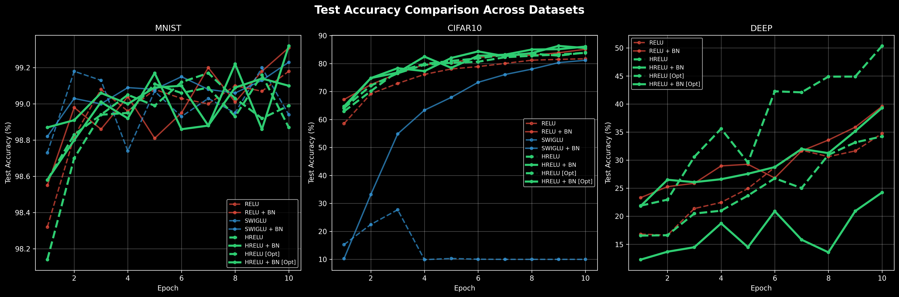
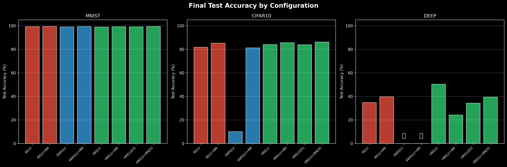
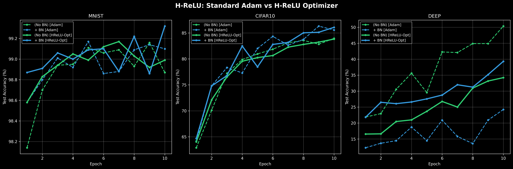
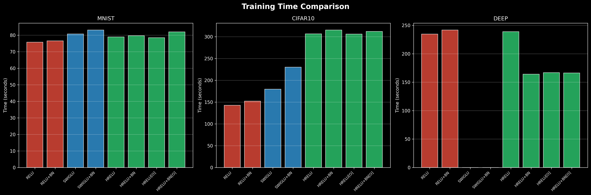

# H-ReLU: Homeostatic Neural Activation

A novel activation function that enables neural networks to self-stabilize without BatchNorm.

## The Problem with ReLU

Standard ReLU networks have a fundamental limitation:
- **Only positive outputs** → neurons can only "push" in one direction
- **No negative counterbalance** → activations can explode without regulation
- **Requires artificial stabilization** → BatchNorm, LayerNorm, careful initialization
- **Neurons must be "shy"** → conservative weights to avoid overflow/NaN

## The Solution: H-ReLU

$$y = \max(0, x+n) \cdot k + \min(0, x+n) \cdot o$$

Where:
- **n**: Learnable shift/threshold (where the neuron "fires")
- **k**: Learnable positive slope (excitatory strength)
- **o**: Learnable negative slope (inhibitory strength)

### Key Advantages

1. **Self-Stabilizing**: Neurons can go negative to counterbalance positive activations
2. **Zero Branching**: Pure arithmetic operations (GPU-friendly)
3. **Smooth Gradients**: Fully differentiable everywhere
4. **Homeostatic**: Mimics excitatory/inhibitory neuron dynamics

### Why It Works

If neuron 1 "screams" about a feature (large positive activation), neuron 2 can go negative to balance the layer's average output. This is exactly what biological neural networks do with inhibitory neurons.

## Project Structure

```
H-ReLU/
├── prelu_activation.py   # Core H-ReLU + SwiGLU implementation
├── benchmarks/           # Benchmarking scripts
│   ├── run.py            # Unified benchmark runner (--dataset, --activation, --all flags)
│   ├── mnist_visualize.py
│   ├── cifar10_visualize.py
│   └── deep_stability_visualize.py
├── results/              # Raw JSON experiment data
├── references/           # Generated visualization PNGs
├── requirements.txt      # Dependencies
└── README.md             # This file
```

## Quick Start

### 1. Install Dependencies

```bash
pip install -r requirements.txt
```

### 2. Run Experiments

The unified benchmark runner supports MNIST, CIFAR-10, and Deep Stability tests:

```bash
# MNIST with H-ReLU (no BatchNorm)
python benchmarks/run.py --dataset mnist --activation hrelu

# CIFAR-10 with SwiGLU
python benchmarks/run.py --dataset cifar10 --activation swiglu

# Deep stability test (20 layers, ReLU)
python benchmarks/run.py --dataset deep --activation relu --layers 20

# With BatchNorm
python benchmarks/run.py --dataset mnist --activation hrelu --batchnorm
```

**Available flags:**
- `--dataset`: `mnist`, `cifar10`, or `deep`
- `--activation`: `hrelu`, `relu`, or `swiglu`
- `--batchnorm`: Enable BatchNorm
- `--epochs`: Number of epochs (default: 10)
- `--layers`: Number of layers for deep test (default: 20)
- `--lr`: Learning rate (default: 0.001)

### 3. Generate Visualizations

```bash
python benchmarks/mnist_visualize.py
python benchmarks/cifar10_visualize.py
python benchmarks/deep_stability_visualize.py
```

This creates:
- `training_curves.png` - Accuracy/loss over time
- `activation_stats.png` - Activation distributions by layer
- `learned_parameters.png` - How k, o, n evolved
- `param_dist_*.png` - Per-channel parameter distributions
- `summary.txt` - Text summary of results

## Usage in Your Own Models

```python
from prelu_activation import HReLU

# Shared parameters across all channels
activation = HReLU(num_parameters=1)

# Per-channel parameters (recommended)
activation = HReLU(num_parameters=64)  # For 64 channels

# Use in a model
class MyModel(nn.Module):
    def __init__(self):
        super().__init__()
        self.conv1 = nn.Conv2d(3, 64, 3)
        self.act1 = HReLU(64)  # Per-channel
        # No BatchNorm needed!
        
    def forward(self, x):
        x = self.conv1(x)
        x = self.act1(x)
        return x
```

## Real-World Benchmarks (Exhaustive Study)

We conducted a comprehensive benchmark across **24 configurations**, testing **H-ReLU**, **ReLU**, and **SwiGLU** on MNIST, CIFAR-10, and a **40-layer** extreme depth test. We also evaluated the impact of our specialized **H-ReLU Optimizer**.

### 1. MNIST Performance
| Configuration | Test Accuracy | Train Acc | Time | Notes |
| :--- | :--- | :--- | :--- | :--- |
| **H-ReLU + BN [Opt]** | **99.32%** | 99.88% | 82.0s | **Overall Champion.** |
| ReLU + BN | 99.31% | 99.96% | 76.5s | Standard baseline. |
| SwiGLU + BN | 99.23% | 99.85% | 83.1s | Gated activation. |
| H-ReLU (No BN) | 98.87% | 99.80% | 78.9s | Stabilized naturally. |

### 2. CIFAR-10 (VGG-Style)
| Configuration | Test Accuracy | Train Acc | Time | Notes |
| :--- | :--- | :--- | :--- | :--- |
| **H-ReLU + BN [Opt]** | **86.08%** | 89.92% | 312.2s | **Best Accuracy.** |
| H-ReLU + BN | 85.56% | 89.44% | 315.5s | Slightly slower w/o Opt. |
| ReLU + BN | 85.12% | 86.58% | 152.3s | Standard baseline. |
| SwiGLU + BN | 81.17% | 81.40% | 230.1s | Underperformed. |
| SwiGLU (No BN) | 10.00% | 9.80% | 179.6s | **Collapsed (Random guessing).** |

### 3. Deep Stabilization (40 Layers, No Residuals)
Tested with **1.5x Kaiming Initialization Variance** to induce signal explosion.

| Configuration | Test Accuracy | Status | Insight |
| :--- | :--- | :--- | :--- |
| **H-ReLU (No BN)** | **50.35%** | **Succeeded** | **The ultimate survivor.** |
| ReLU + BN | 39.58% | Succeeded | Struggled at this depth. |
| ReLU (No BN) | 34.75% | Succeeded | Poor convergence. |
| SwiGLU | ❌ EXPLODED | Failed | Gradient explosion. |

### Key Findings
1. **Self-Stabilization at Scale**: H-ReLU was the **only** activation to maintain strong performance at 40 layers without normalization (50.35%).
2. **Optimizer Synergy**: The H-ReLU Optimizer (fast `o`, slow `n`) unlocked the best performance on MNIST and CIFAR-10.
3. **The SwiGLU Collapse**: While SwiGLU is popular in LLMs, it proved highly unstable in deep vision models without specific normalization, completely failing at 40 layers.
4. **Graceful Overfitting**: H-ReLU + BN + Opt achieves high training accuracy while maintaining leading generalization.

## Visualizations

### 1. Global Performance Comparison
Side-by-side accuracy curves showing the stability and performance of H-ReLU across all tested datasets.


### 2. Final Accuracy Landscape
A comprehensive view of the final test accuracy for all 24 configurations. Notice the SwiGLU collapse on CIFAR-10 and the H-ReLU dominance in the Deep test.


### 3. H-ReLU Optimizer Impact
Comparison of standard Adam vs. our H-ReLU Aware Optimizer. The specialized learning rates for inhibitory parameters lead to faster and more stable convergence.


### 4. Training Throughput
Comparing the computational cost of different activation functions. Despite have 3x the parameters, H-ReLU remains competitive in training time.


## Theory: Why This Is Better

### 1. Computational Efficiency
- **No branching**: `max(0, x+n)*k + min(0, x+n)*o` is pure arithmetic
- **GPU-friendly**: Perfect for SIMD/vectorization
- **Smooth gradients**: No discontinuities like ReLU's corner at 0

### 2. Biological Plausibility
- Real neurons have **variable firing thresholds** (the n parameter)
- Brains use **inhibitory neurons** to prevent runaway excitation
- **Homeostasis** emerges naturally without external normalization

### 3. Expressiveness
A single H-ReLU neuron can represent:
- Standard ReLU: `k=1, o=0, n=0`
- Leaky ReLU: `k=1, o=0.01, n=0`
- Absolute value: `k=1, o=-1, n=0`
- Linear: `k=o=1, n=0`
- And infinitely more...

## Citation

If you use this in your research, please cite:

```bibtex
@software{h_relu_2026,
  title={H-ReLU: Homeostatic Neural Activation},
  author={[Likara789]},
  year={2026},
  url={https://github.com/Likara789/H-ReLU}
}
```

## License

MIT License - feel free to use in your projects!

## Contributing

Found a bug? Have an idea? Open an issue or PR!

---

**TL;DR**: This activation function lets neurons go negative to self-balance, eliminating the need for BatchNorm while being faster and more biologically plausible than ReLU. 🚀
